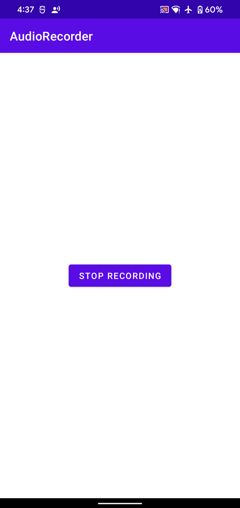
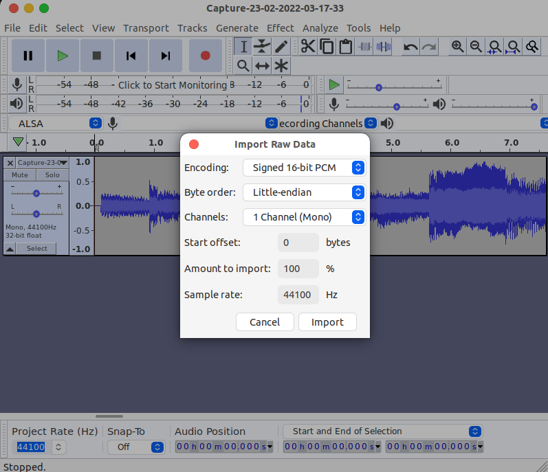

# AudioCaptureSample

Sample app for AudioPlaybackCapture API, which allows applications to capture the audio of other applications.



### Usage

Tapping the "Capture audio" button on the UI will present two permission requests:
 - [record audio permission](https://developer.android.com/reference/android/Manifest.permission#RECORD_AUDIO)
 - [media projection permission](https://developer.android.com/reference/android/media/projection/MediaProjectionManager#createScreenCaptureIntent())


 - Sample rate: 44100 Hz
 - channel: 1 channel(Mono)
 - encoding: PCM 16-bit
 - byte-order: little endian

### File Storage
```
/storage/emulated/0/Android/data/com.myfreax.audiorecorder/files/AudioCaptures/
```

You can then pull the file from the device and play the media back. Make sure you use a player that is capable of rendering raw PCM data (for example, on [Audacity](https://www.audacityteam.org/download/), you can `File > Import > Raw Data`).


